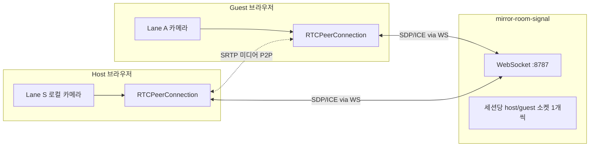
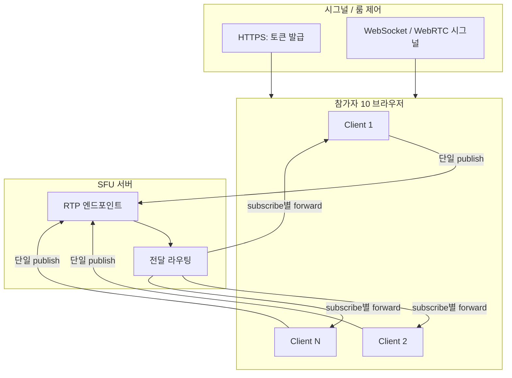

# Mirror Room — SFU 마이그레이션 가이드

**목표:** 약 **10명이 동시에 카메라를 송출**하고 서로(또는 공통 화면)에서 볼 수 있도록, 현재의 **1:1 WebRTC + 자체 WebSocket 시그널** 구조에서 **SFU(Selective Forwarding Unit)** 기반 아키텍처로 옮기기 위한 설계·실행 문서입니다.

---

## 1. 왜 SFU인가

### 1.1 현재 Mirror Room의 한계

현재 앱은 다음 전제를 둡니다.

- **세션(`sessionId`)당 참가자 2명:** 호스트 1 + 게스트 1 (`packages/mirror-room-signal`).
- **미디어 경로:** 브라우저 `RTCPeerConnection`으로 **P2P 1채널** (호스트 ↔ 게스트).
- **시그널:** 작은 JSON 메시지(`hello-host` / `hello-guest` / `offer` / `answer` / `ice-candidate`)를 WebSocket으로 중계.

10명이 “각자 카메라를 올리고 서로 본다”는 요구에서는 **각 피어가 다른 9명과 직접 미디어 연결을 맺는 full mesh**에 가까워지고, 송수신부 수가 \(O(N^2)\)로 커져 **단말 CPU·업링크 대역**이 금방 한계에 걸립니다.

### 1.2 SFU가 주는 것

| 구분         | Full mesh (직접 연결)          | SFU                                                  |
| ------------ | ------------------------------ | ---------------------------------------------------- |
| 상행(업링크) | 이론상 \((N-1)\)개 스트림 송신 | **클라이언트당 1개** 업링크(보통 1 영상 트랙)        |
| 하행         | \((N-1)\)개 수신               | 서버가 **선택적으로 전달**(구독·레이어·simulcast 등) |
| 시그널       | SDP/ICE 교환 복잡도 급증       | **SFU가 정의한 API**(또는 SDK)로 일원화              |

**정석:** “N명 모두 송출”에는 **SFU + 그 SFU가 제공(또는 권장)하는 시그널/클라이언트 SDK**를 쓰는 것이 운영·보안·디버깅까지 포함해 가장 현실적입니다.

---

## 2. 현재 시스템 맵 (마이그레이션 출발점)

### 2.1 런타임 구성

- **개발:** Vite가 `wss://<호스트>/__mirror_room_signal`을 **8787로 프록시** (`apps/mirror-room/vite.config.ts`, `src/webrtc/ice.ts`의 `DEV_SIGNAL_WSS_PATH`).
- **ICE:** `VITE_ICE_SERVERS` 없으면 Google 공용 STUN; 엄격 NAT·릴레이에는 **TURN** 별도 구성 필요(현재도 동일 이슈).

### 2.2 앱 코드에서 교체·확장의 핵심 지점

| 영역           | 파일/패키지                                       | 마이그레이션 시 의미                                                                                           |
| -------------- | ------------------------------------------------- | -------------------------------------------------------------------------------------------------------------- |
| 시그널 서버    | `packages/mirror-room-signal`                     | **제거 또는 폐기.** SFU가 시그널·토큰·룸 API를 담당.                                                           |
| 호스트 WebRTC  | `apps/mirror-room/src/webrtc/use-host-webrtc.ts`  | **교체:** 1 remote stream 가정 제거 → N개 `RemoteTrack`/participant.                                           |
| 게스트 WebRTC  | `apps/mirror-room/src/webrtc/use-guest-webrtc.ts` | **교체:** “게스트 전용”이 아니라 **동일한 Room 클라이언트**로 통합 가능.                                       |
| ICE/시그널 URL | `apps/mirror-room/src/webrtc/ice.ts`              | **대체:** 선택한 SDK의 URL·토큰·WebSocket 정책으로 치환.                                                       |
| UI 라우팅      | `app.tsx`, `host-page.tsx`, `guest-page.tsx`      | 2인 전용 UX → **단일 룸 URL** 또는 “참가 링크 + 역할”로 단순화 검토.                                           |
| 합성기         | `compositor-canvas.tsx` 등                        | 지금은 **비디오 2레인(S/A)** 가정. 10인이면 **레이아웃·입력 수** 재설계(그리드/스폿라이트/대표 2명만 분석 등). |

### 2.3 유지할 수 있는 부분

- **MediaPipe 얼굴·모션 분석** 로직은 “어떤 `HTMLVideoElement`/`MediaStreamTrack`을 읽느냐”만 바꾸면 재사용 가능.
- **Vite + HTTPS(dev)** , **환경변수로 공개 origin** 두는 방식은 그대로 쓸 수 있음 (`VITE_PUBLIC_ORIGIN` 등).
- **`scripts/sync-mediapipe-public.mjs`** 및 `public/mediapipe` 동기화는 SFU와 무관하게 유지.

---

## 3. 목표 아키텍처 (SFU)

### 3.1 논리 구조

- 각 클라이언트는 **한 번(또는 소수)** 미디어를 올리고, 서버가 **다른 참가자에게 골라서** 내려보냅니다.
- **시그널**은 더 이상 “직접 JSON으로 SDP 주고받기”가 아니라, **선택한 제품의 프로토콜**(REST + JWT, Socket, gRPC 등)을 따릅니다.

### 3.2 이 레포에서의 배치 옵션

| 방식               | 설명                                   | 이 프로젝트에 맞을 때                        |
| ------------------ | -------------------------------------- | -------------------------------------------- |
| **매니지드 SFU**   | LiveKit Cloud, Daily, Twilio Video 등  | 설치·전시 일정이 빡빡하고, 인프라 최소화     |
| **셀프호스트 SFU** | LiveKit OSS, mediasoup, Janus, Pion 등 | 네트워크 폐쇄, 비용·데이터 주권, 커스텀 필요 |

문서는 구현 중립이지만, **빠른 검증**에는 매니지드 + 공식 JS SDK 조합이 일반적으로 가장 실패가 적습니다.

---

## 4. 시그널 / 클라이언트 SDK — “무엇을 고르나”

### 4.1 평가 기준 (체크리스트)

다음을 표로 비교해 한 가지를 **기준선(Golden Path)** 으로 정하는 것을 권장합니다.

1. **브라우저 지원:** Chrome / Safari(iOS) / Firefox 중 전시에 필요한 조합.
2. **동시 접속·가격:** 분 단위 과금, 동시 방 수, egress 정책.
3. **대역·해상도:** 10路 720p 동시 수신 시 서버·클라이언트 부하; **simulcast / SVC** 지원 여부.
4. **NAT traversal:** 호스트 제공 TURN인지, 자체 [coturn](https://github.com/coturn/coturn) 연동인지.
5. **보안:** 참가 토큰(JWT), 룸 ACL, 녹화·리레이 법무 고지.
6. **프런트 통합:** React 훅/컴포넌트 품질, TypeScript 타입.

### 4.2 대표 스택 (예시만 — 버전·API는 공식 문서 우선)

| 스택      | SFU·시그널                           | 클라이언트           |
| --------- | ------------------------------------ | -------------------- |
| LiveKit   | LiveKit Server / Cloud + 토큰 API    | `livekit-client`     |
| mediasoup | mediasoup-demo 또는 자체 시그널 서버 | `mediasoup-client`   |
| Daily     | Daily REST + 룸                      | `@daily-co/daily-js` |

**주의:** 이 문서는 특정 벤더 튜토리얼을 대체하지 않습니다. 확정 후에는 **해당 문서의 Room 연결·publish·subscribe 패턴**을 “단일 기준 코드 경로”로 정리하세요.

---

## 5. Mirror Room 도메인 모델 변화

### 5.1 세션 / 룸

| 현재                                 | SFU 이후                                          |
| ------------------------------------ | ------------------------------------------------- |
| `sessionId` = 호스트·게스트 2인 고정 | `room` = 10인(또는 가변) 참가자 집합              |
| QR로 `/g/:sessionId`                 | QR/링크로 **동일 룸 입장**(토큰 또는 invite code) |

### 5.2 “호스트” 개념

- **네트워크 상:** SFU는 모든 참가자에 대칭에 가깝게 동작합니다.
- **제품 UX 상:** “설치용 메인 디스플레이”만 대형 화면이고 나머지는 폰일 수 있으므로, **역할(role)** 을 앱 레벨에서만 두면 됩니다(예: `presenter` / `audience`). SFU가 반드시 “호스트 1명”을 요구하지는 않습니다.

### 5.3 합성기(Compositor)

현재 스펙은 **Lane S(로컬) + Lane A(원격 1)** 에 최적화되어 있습니다. 10인 송출 시 선택지는 다음 중 하나입니다.

1. **그리드:** 10개의 작은 썸네일에서 모션/얼굴 요약만 추출해 추상 패턴 생성.
2. **스폿라이트:** SFU 또는 앱 로직으로 “현재 말하는 사람” 1~2명만 고해상도 구독, 나머지 저해상도.
3. **운영자 픽:** 전시 시나리오상 항상 고정된 2명만 분석 소스로 사용.

각각 **subscribe 정책**과 **CPU 예산**이 다르므로, “10명 전원 720p를 합성기 전부에 넣기”는 현실적으로 과합니다.

---

## 6. 단계별 마이그레이션 계획

### Phase 0 — 결정·스파이크 (1~3일)

- [ ] Golden Path 스택 확정(매니지드 vs 셀프호스트).
- [ ] **스파이크 앱**: 브라우저 2~3개로 동시 publish / subscribe 성공, iOS Safari 포함.
- [ ] TURN 필요 여부(현장 네트워크) 확인.

### Phase 1 — 인프라·시크릿

- [ ] 룸 생성·**참가 토큰** 발급 API(백엔드 또는 서버리스) 설계. **토큰을 프런트에 하드코딩하지 않기.**
- [ ] 프로덕션 환경변수: `VITE_*`에 **키 자체를 넣지 않고**, 짧은 수명 토큰만 세션 단위로 받는 패턴 권장.
- [ ] `mirror-room-signal` 배포 제거 또는 “레거시 모드”로 분리 여부 결정.

### Phase 2 — 클라이언트 통합

- [ ] `use-host-webrtc` / `use-guest-webrtc` **대체 모듈** 추가(예: `use-sfu-room.ts`).
- [ ] 기존 `getSignalUrl` / raw WebSocket 시그널 의존 제거(선택 스택의 connect 플로우로).
- [ ] `RemoteStream` 단일 state → **participants 목록 + track 참조**로 리팩터.

### Phase 3 — UI·합성기

- [ ] 라우팅 단순화(호스트/게스트 페이지 통합 여부).
- [ ] `CompositorCanvas` 입력 모델 변경(다트랙/다비디오).
- [ ] 디버그 오버레이(연결 품질, 구독 레이어) 추가 권장.

### Phase 4 — 배포·현장 운영

- [ ] HTTPS, 인증서, 방화벽 포트(SFU/TURN/HTTPS) 체크리스트.
- [ ] 동시 10명 부하 테스트(실기기 Mix).
- [ ] 롤백: 문제 시 이전 1:1 빌드로 되돌릴 **브랜치/태그** 유지.

---

## 7. 환경·배포 메모

### 7.0 현재 스택(1:1) — 공개 배포와의 정합성

SFU로 바꾸기 **전에도**, 정적 프론트만 배포하고 QR로 원격에서 붙이려면 **`mirror-room-signal`을 공개 `wss://`로 노출**하고 빌드 시 `VITE_SIGNAL_URL`을 설정해야 합니다. 절차·터널·프록시는 **[Mirror Room — 공개 배포](./mirror-room-public-deploy.md)** 를 따릅니다. SFU 도입 후에는 시그널 엔드포인트가 SFU/SDK 쪽으로 바뀌지만, “프론트 단독 배포로는 부족하다”는 원칙은 동일합니다.

### 7.1 개발

- 현재: `pnpm dev:mirror-room-signal` + `pnpm dev:mirror-room` 이원화.
- SFU 도입 후: **로컬 SFU 도커** 또는 **클라우드 샌드박스 룸** 중 하나로 통일하는 편이 디버깅에 유리합니다.

### 7.2 프로덕션

- **미디어 서버 region** 을 관객/참가자 위치에 가깝게.
- **대역폭:** 10명 × 송신 bitrate + 수신(구독 수 × bitrate). 시뮬레이션시 서버 egress 요금·CPU도 함께 봅니다.

---

## 8. 보안·프라이버시

- **카메라·마이크** 사용 목적, **미디어가 서버를 통과**할 수 있음을 UI 카피에 반영(특히 릴레이/TURN 시).
- 참가 링크는 **추측 불가능한 토큰** + 필요 시 **만료 시간**.
- 녹화·리플레이가 없다면 명시.

---

## 9. 테스트 시나리오 (최소)

1. 동일 Wi‑Fi, 10 브라우저/기기에서 동시 입장·퇴장.
2. 1명 네트워크 끊김 → 나머지에 대한 영향(얼룩·freeze) 허용 범위 확인.
3. iOS Safari + Android Chrome 혼합.
4. 제한적 네트워크(테더링)에서 TURN 강제 또는 저bitrate 프로파일.
5. 합성기 프레임 예산: `requestAnimationFrame` 기준 목표 FPS 유지 여부.

---

## 10. 요약

| 질문                            | 답                                                            |
| ------------------------------- | ------------------------------------------------------------- |
| 10명이 다 카메라를 올릴까?      | **SFU**가 정석.                                               |
| 지금 시그널 서버만 늘리면 되나? | **부족.** 미디어 경로와 시그널 형식이 SFU에 맞아야 함.        |
| 이 레포에서 큰 덩어리는?        | `mirror-room-signal`, `use-*-webrtc`, **2인 가정 UI/합성기**. |
| 무엇을 먼저 하나?               | **스택 선정 + 3대 이상 스파이크** 후 Phase별로 치환.          |

---

## 11. 참고 (코드 위치)

- 시그널: `packages/mirror-room-signal/src/server.mjs`
- WebRTC 훅: `apps/mirror-room/src/webrtc/use-host-webrtc.ts`, `use-guest-webrtc.ts`
- 시그널 URL·ICE: `apps/mirror-room/src/webrtc/ice.ts`
- Vite 프록시: `apps/mirror-room/vite.config.ts`
- 앱 실행 문서: [`apps/mirror-room/README.md`](../../apps/mirror-room/README.md)

이 문서는 구현 세부 API를 벤더에 종속시키지 않기 위해 **의사결정·경계·순서**에 무게를 둡니다. 스택을 확정한 뒤 **부록으로 “LiveKit 기준 연결 순서”** 같은 하위 문서를 추가하면 유지보수에 유리합니다.
