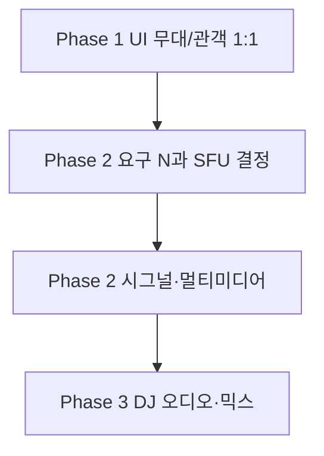

# Mirror Room — 무대/관객 UI · 다자 참여 · DJ 오디오 로드맵

호스트를 “무대”, 게스트를 “관객”으로 프레이밍하는 UI부터, 다자 송수신(SFU 등), DJ 오디오·믹스까지 **단계별 실행 계획**이다. 현재 앱은 **호스트 1 + 게스트 1**, **단일 `RTCPeerConnection`**, 시그널은 `packages/mirror-room-signal` 기준으로 가정한다.

관련 문서:

- [공개 배포](./mirror-room-public-deploy.md) — `VITE_SIGNAL_URL`, 정적 호스팅
- [SFU 마이그레이션](./mirror-room-sfu-migration.md) — 다자·SFU 큰 그림

---

## 0. 현재 전제 (베이스라인)

| 영역      | 상태                                                                                  |
| --------- | ------------------------------------------------------------------------------------- |
| 시그널    | WebSocket — `hello-host` / `hello-guest`, `offer` / `answer`, ICE                     |
| 미디어    | 브라우저 WebRTC P2P **한 쌍**                                                         |
| 호스트 UI | Lane S(로컬 캠) + Lane A(원격 1명) — `CompositorCanvas`                               |
| 오디오    | 호스트 `getUserMedia`가 `audio: false`에 가깝게 잡혀 있어, DJ 오디오는 아직 스코프 밖 |

---

## Phase 1 — UI: “무대 / 관객” (1:1 유지)

**목표:** 참가자 수는 그대로 두고, 호스트를 **무대**, 게스트를 **관객 시점**으로 프레이밍한다. WebRTC/시그널 **변경 없이** 체감을 바꾼다.

### 1.1 정보 구조

| 역할         | 설명                                                  |
| ------------ | ----------------------------------------------------- |
| 무대 (Host)  | 메인 비디오 영역, 시각적·인터랙션의 중심              |
| 관객 (Guest) | 작은 썸네일/PIP, 자신도 송출 중이라는 **증거**는 유지 |

### 1.2 호스트 화면 (`apps/mirror-room/src/routes/host-page.tsx`)

- **레이아웃**
  - **Primary**: Lane S(로컬 캠) — 화면 폭의 대략 65–80%, 상단 또는 중앙 정렬.
  - **Secondary**: Lane A(원격 게스트) — 우하단 PIP 또는 좌측 세로 “관객 스트립” (고정 비율 16:9 또는 1:1).
- **CompositorCanvas**
  - 처리 해상도는 유지하되, 합성 영역 내에서 S/A 가중치를 조절할지, 상위 레이아웃만 분리할지 결정.
- **모드/토글**
  - `무대 모드` vs 기존 `듀얼 대등` 토글 — 설치 작품이면 **기본을 무대 모드**로 두는 것을 권장.

### 1.3 게스트 화면 (`guest-page.tsx`)

- 로컬 카메라: 작은 프리뷰 + “내가 송출 중” 강조.
- 원격(호스트): **크게** 보여 “무대를 보는” 경험과 일치 (호스트 화면의 S/A 비율과 **서로 대칭**이면 이해도가 좋음).
- 세션/연결 상태는 secondary UI(하단·접이식).

### 1.4 인터랙션·테마

- 호스트 전용: “관객 연결됨” 배지, Lane A 썸네일 테두리로 **라이브 관객** 느낌.
- **접근성**: 작은 영역도 터치 타겟 최소 크기 유지.

### 1.5 Phase 1 완료 수용 기준

- 모바일 게스트: 세로 화면에서도 **호스트(무대)가 한눈에** 들어온다.
- 데스크톱 호스트: 게스트 PIP가 **가려지지 않고** (안전 영역) 배치된다.
- 기존 WebRTC/시그널 **변경 없이** 동작한다.

### 1.6 리스크

- Compositor 내부가 S/A를 동등하게 가정하면, **일부 모드**에서 시각 균형이 깨질 수 있음 → 모드별 QA 리스트 필요.

---

## Phase 2 — 참가자 여러 명 (시그널 + 미디어 아키텍처)

**목표:** “다른 사람**들**”이 **동시에** 송수신 가능한 방을 정의하고, 확장 가능한 경로를 고른다.

### 2.1 요구사항 먼저 고정 (의사결정 입력)

문서로 숫자를 박아둔다.

- **동시 송출 상한** (예: 6 / 12 / 50).
- **역할**: 호스트 고정 1명? 공동 호스트? 순수 관객(수신만)?
- **레이아웃 규칙**: 누가 “무대”인지, 나머지는 타일만? 하이라이트?
- **지연**: 라이브 DJ면 목표 **엔드투엔드 지연** (예: &lt;500ms vs &lt;2s).
- **배포**: 전부 브라우저? 설치용 키오스크?

**이 숫자에 따라 Mesh vs SFU가 갈린다.**

### 2.2 아키텍처 옵션

| 방식          | 적합한 N        | 장점                 | 단점                                |
| ------------- | --------------- | -------------------- | ----------------------------------- |
| **Full mesh** | 작음 (2–4)      | 서버 미디어 불필요   | 업로드 N배, CPU/배터리, 모바일 한계 |
| **SFU**       | 중·대 (일반적)  | 업로드 1회·확장 유리 | SFU 인프라·비용·운영                |
| **MCU**       | 특수(합성 서버) | 서버에서 합성        | 비용·지연·복잡도 큼                 |

**권장 방향:** “파티/클럽” 비전에는 **SFU를 기본안**으로 두고, 아주 작은 실험만 메시로 시작하는 **하이브리드**도 가능 (예: N≤3는 메시, 그 이상은 SFU — 구현 복잡도는 증가).

### 2.3 시그널 레벨 설계 (SFU 가정 시 개요)

현재는 **세션당 1쌍의 offer/answer 서사**에 가깝다. 다자에서는 보통:

- **룸 ID** = 지금의 `sessionId` 확장 또는 상위 개념 도입.
- **클라이언트 ID** (socket 또는 peer id).
- 메시지 타입 확장 예: `join`, `leave`, `publish`, `subscribe`; SFU용 **클라이언트↔SFU** SDP만.
- 또는 WHIP/WHEP, 또는 벤더 SDK 시그널.

**`mirror-room-signal`의 역할 선택지:**

1. **얇은 시그널만** (SDP/ICE 중계) + 미디어는 외부 SFU (LiveKit, Daily, mediasoup 등 자체 호스팅).
2. **시그널 + mediasoup worker** 등을 같은 레포/배포에 묶기 (운영 부담 증가).

### 2.4 클라이언트 상태 모델 변경

- 호스트: `Map<peerId, RTCPeerConnection | transceiver>` 또는 SDK 세션 객체.
- 또는 **단일 PeerConnection에 여러 transceiver** (SFU는 보통 한 PC에 여러 m-line).

### 2.5 UI와의 연결

- **Lane A 하나** → **관객 트랙 배열** (그리드, 캐러셀, “메인 관객” 선택).
- **Compositor**: 현재 Lane A는 1스트림 — 다자면 **대표 1명만 얼굴 분석** vs **다운샘플 합성** 등 정책 필요.

### 2.6 마이그레이션 단계 (실무 순서)

1. **프로토타입**: 외부 SFU SaaS로 “3인 방”만 검증 (시그널 최소 수정).
2. **세션 모델** 정리: 1:1 호환 레이어 유지 vs 완전 전환.
3. **self-hosted SFU**로 이전 (비용/데이터 주권).
4. **장애·재연결·TURN** 정책 문서화.

### 2.7 Phase 2 수용 기준 (예시)

- 동시 N명에서 **안정적인 업로드·구독**.
- 참가/퇴장 시 **나머지 참가자 끊김 최소화**.
- 호스트 “무대” 레이아웃 규칙이 **N명**에서도 정의됨.

---

## Phase 3 — DJ 오디오 (범위·믹스)

**전제:** Phase 1·2의 **영상 경로**가 안정된 뒤에 들어가면 디버깅이 쉽다.

### 3.1 제품 시나리오

| 시나리오 | 설명                                                     |
| -------- | -------------------------------------------------------- |
| A        | 호스트 **말하기**(마이크) + 관객 응답(보이스)            |
| B        | 호스트 **음악**(파일/DAW/탭) + 간헐적 말                 |
| C        | 관객에게 **같은 믹스**를 들려줄지 vs **무대만** 들려줄지 |

A만 먼저 해도 “클럽” 느낌의 절반은 올라간다.

### 3.2 브라우저 캡처 소스

- **마이크**: `getUserMedia({ audio: true })` — 호스트/게스트 트랙에 추가.
- **탭/화면 오디오**: `getDisplayMedia` with `audio: true` — 브라우저/OS 제약 큼, 사용자 제스처 필수.
- **파일 재생**: `<audio>` 또는 Web Audio → `MediaStreamDestination` → `captureStream()` — **통제하기 가장 쉬운 음악 소스** 쪽.

### 3.3 믹스 전략

- **클라이언트 믹스 (Web Audio API)**
  - 게인·EQ·컴프는 제한적으로.
  - 출력 스트림을 **하나의 `MediaStream`**으로 만들어 SFU/P2P에 **단일 오디오 트랙**으로 올리기 쉽다.
- **서버 믹스 (MCU)**
  - DJ급 품질·동기는 어렵고 비용·지연 증가 — 초기에는 비추.

### 3.4 WebRTC 측면

- 오디오/비디오 **트랙 분리** 또는 **합성 후 단일 트랙** — SFU 구독 정책과 맞춰야 함.
- **에코**: 호스트 스피커 + 마이크 조합 시 **에코 캔슬**·헤드폰 권장 UX 카피.

### 3.5 법·UX

- 음악 재생 시 **공연권/저작권**은 작품 컨텍스트에서 별도 검토.
- Safari/iOS **오디오 autoplay** 정책 — 재생 버튼/제스처.

### 3.6 Phase 3 수용 기준 (예시)

- 호스트: 마이크 + (선택) 파일 믹스가 **상대에게 지연 허용 범위** 내로 들림.
- 게스트: 말하기 on/off, 음소거 UX 명확.
- SFU 사용 시 **오디오 구독**이 영상과 동기 붕괴 없이 동작.

---

## 타임라인 제안 (대략)

| 기간             | 산출물                                                                    |
| ---------------- | ------------------------------------------------------------------------- |
| **스프린트 1**   | Phase 1 UI 스펙 확정, 호스트/게스트 레이아웃 구현, 반응형 QA              |
| **스프린트 2–4** | Phase 2 요구사항 숫자 확정, SFU PoC(3–5인), 시그널 메시지 설계·프로토타입 |
| **스프린트 5+**  | mirror-room 멀티 스트림 UI, compositor 정책, TURN/운영                    |
| **스프린트 6+**  | Phase 3: 호스트 마이크 트랙, 파일 믹스 PoC, 이후 탭 캡처                  |

팀 규모·SFU 선택에 따라 크게 달라진다.

---

## 의존성 (요약)

---

## 바로 다음 액션 (체크리스트)

1. Phase 1: 호스트/게스트 **와이어프레임** 2장 + breakpoint 2개(폰 세로·호스트 데스크톱).
2. Phase 2: **동시 인원 상한·역할** 한 페이지 결정서.
3. SFU: **SaaS PoC 1주** vs **self-hosted PoC 2주** 중 선택.
4. Phase 3: “마이크만” vs “파일 믹스까지” **MVP 범위** 한 줄로 고정.

---

## 변경 이력

| 날짜   | 내용                                                 |
| ------ | ---------------------------------------------------- |
| (초안) | 무대/관객 UI · 다자 · DJ 오디오 단계별 로드맵 문서화 |
