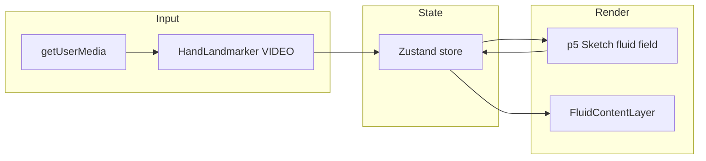

# Hand-Fluid 작품: 기술 스택 학습 가이드

이 문서는 **카메라 + MediaPipe 손 추적 + p5 기반 유체장 + React 레이어**로 구성된 현재 설치작품형 페이지를 이해하기 위한 학습용 정리입니다.  
코드 기준 경로는 저장소 루트(`/Users/.../creative-coding`)를 가정합니다.

---

## 1. 전체 그림

브라우저 안에서 일어나는 일을 한 줄로 말하면:

1. **비디오 스트림**에서 프레임을 읽고
2. **Hand Landmarker**로 검지 끝 좌표를 구한 뒤
3. 그 위치/속도로 **낮은 해상도의 스칼라 필드**(“얼마나 교란되었는지”)를 갱신하고
4. 필드의 세기를 바탕으로 **텍스트 레이어의 선명도·블러**를 바꿉니다.

---

## 2. Vite + React + TypeScript

### 역할

| 도구           | 이 프로젝트에서 하는 일                                                                                   |
| -------------- | --------------------------------------------------------------------------------------------------------- |
| **Vite**       | 개발 서버, HMR, 프로덕션 번들. `import.meta.env.BASE_URL`로 배포 경로(서브디렉터리 등)에 맞는 URL을 만듦. |
| **React**      | UI 셸(`App`), 레이어 컴포넌트 배치, **한 번 마운트될 때** 입력 브로커(`useEffect`) 시작.                  |
| **TypeScript** | 타입으로 상태·옵션 계약을 명확히 함. 빌드는 `tsc -b` 후 `vite build`.                                     |

### 왜 `App`에서만 `setupInputBroker`를 부르는가?

카메라·`requestAnimationFrame` 루프·MediaPipe 인스턴스는 **앱 수명과 같이 살아야** 하고, 언마운트 시 트랙 정리·`close()`가 필요합니다.  
그래서 `App`의 `useEffect`에서 시작하고, cleanup에서 `teardown()`을 호출합니다.  
시각 레이어(`Sketch`, `FluidContentLayer`)는 “구독자” 역할만 하도록 두면 구조가 단순해집니다.

관련 파일: [`src/app.tsx`](../../apps/viscous-memory/src/app.tsx)

---

## 3. 브라우저 카메라 API (`getUserMedia`)

### 핵심 개념

- `navigator.mediaDevices.getUserMedia({ video: true })`는 **사용자에게 권한을 요청**하고 `MediaStream`을 줍니다.
- 스트림은 `HTMLVideoElement`에 `srcObject`로 연결한 뒤 `play()` 합니다.
- **보안 맥락(secure context)**: 배포 시 `https://`가 일반적입니다. 로컬에서는 `http://localhost`가 예외적으로 허용되는 경우가 많습니다.

### 권한 상태 UI

`Camera`, `NotAllowedError` 등은 사용자 경험에 직결되므로, 스토어의 `camera.permission` / `message`로 최소한의 문구만 노출합니다.

관련 파일: [`src/input/setup-input-broker.ts`](../../apps/viscous-memory/src/input/setup-input-broker.ts), [`src/components/camera-status-overlay.tsx`](../../apps/viscous-memory/src/components/camera-status-overlay.tsx)

---

## 4. MediaPipe Tasks Vision — Hand Landmarker

### 무엇인가?

**MediaPipe Hand Landmarker**는 손의 3D 랜드마크(관절/끝점)를 비디오 프레임에서 추정하는 모델입니다.  
이 프로젝트는 `@mediapipe/tasks-vision` 패키지의 **`HandLandmarker`** 클래스를 쓰고, 실행 모드는 **`VIDEO`**(연속 프레임)입니다.

### WASM과 모델 파일

- 브라우저에서는 고성능 추론을 위해 **WebAssembly(WASM)** 바이너리를 로드합니다.
- 손 모델은 **`.task`** 파일(바이너리 가중치 등)로 제공됩니다.

**CDN이 막힌 환경**에서는 외부 URL로 WASM/번들을 불러올 수 없으므로, 이 저장소는 다음 전략을 씁니다.

1. `pnpm install` 시 **`scripts/sync-mediapipe-public.mjs`**가  
   `node_modules/@mediapipe/tasks-vision/wasm/` → `apps/viscous-memory/public/mediapipe/wasm/`로 복사
2. `hand_landmarker.task`를 `apps/viscous-memory/public/mediapipe/`에 두고, 같은 출처 URL로 `modelAssetPath` 지정
3. 런타임에는 `FilesetResolver.forVisionTasks( wasm 디렉터리 URL )`로 WASM을 찾게 함

### 패키지 `exports` 이슈와 Vite 별칭

일부 도구(Node/Vite의 엄격한 resolver)는 `@mediapipe/tasks-vision`의 `package.json` **exports** 형식을 거부할 수 있습니다.  
그래서 `vite.config.ts`에서 패키지 이름을 **`vision_bundle.mjs` 파일 경로로 별칭**해 직접 진입합니다.

관련 파일:

- [`vite.config.ts`](../../apps/viscous-memory/vite.config.ts)
- [`tsconfig.app.json`](../../apps/viscous-memory/tsconfig.app.json) — TypeScript가 동일 심볼을 해석하도록 paths
- [`src/types/mediapipe-tasks-vision.d.ts`](../../apps/viscous-memory/src/types/mediapipe-tasks-vision.d.ts) — 최소 타입 선언
- [`scripts/sync-mediapipe-public.mjs`](../../scripts/sync-mediapipe-public.mjs)
- [`package.json`](../../package.json)의 `postinstall`

### 좌표와 “거울 반전”

랜드마크 `x, y`는 **영상 정규화 공간**(대략 0~1)입니다.  
웹캠은 사용자가 거울처럼 보길 기대하므로, 이 코드에서는 **x를 뒤집어** 화면 오른쪽이 손의 오른쪽이 되게 맞춥니다.

검지 끝 인덱스는 MediaPipe 관례상 **랜드마크 8번**을 사용합니다.

---

## 5. Zustand 상태 관리

### 왜 Zustand인가?

- **입력 스레드**(비디오 + rAF)와 **React 리렌더**가 섞이지 않게, 손 데이터는 스토어에 씁니다.
- p5 `draw`는 React 리렌더와 별개로 매 프레임 실행되므로, `useParamsStore.getState()`로 **구독 없이 읽기**하기 좋습니다.

### 스토어에 있는 것

| 필드         | 의미                                                               |
| ------------ | ------------------------------------------------------------------ |
| `camera`     | 권한/메시지/준비 완료                                              |
| `hand`       | 스무딩된 손 위치, 속도, confidence, `detected`                     |
| `fluidState` | 유체장에서 뽑은 **요약값**(리빌 강도, 블러 등) — DOM 레이어가 구독 |

관련 파일: [`src/store.ts`](../../apps/viscous-memory/src/store.ts)

### 입력 스무딩(EMA)

급격한 트래킹 노이즈를 줄이기 위해 **지수 이동 평균(EMA)** 스타일 보간을 씁니다:

`next = current + (target - current) * smoothing`

`HAND_TRACKING.smoothingPosition`, `smoothingVelocity`가 그 계수입니다.

관련 상수: [`src/config.ts`](../../apps/viscous-memory/src/config.ts)의 `HAND_TRACKING`

---

## 6. p5.js — 유체 “기억” 필드

### Instance mode

`new p5(sketchFn, container)`로 **컴포넌트가 붙인 DOM 노드** 안에만 캔버스를 만듭니다.  
언마운트 시 `remove()`로 정리합니다.

### 스칼라 필드(그리드)

- 화면보다 **작은 그리드**(`fieldScale`)에 `Float32Array` 두 개를 두고, 교대로 읽고/씁니다(더블 버퍼).
- 손이 있을 때: 검지 위치 주변에 **원형 폴백**으로 값을 “예금(deposit)”합니다. 속도가 클수록 세기를 키웁니다.
- 매 스텝: 이웃 평균으로 **확산(diffusion)** + 계수로 **감쇠(decay)** + 약간의 **드래그(advectionDrag)** 를 섞어 “서서히 번지고 사라지는” 느낌을 냅니다.

이건 완전한 나비에–스토크스 유체는 아니고, **설치작품용의 단순화된 메모리 필드**입니다.

### 캔버스와 블렌드

`mix-blend-mode: screen` 등으로 어두운 배경 위에 **은은한 발광**처럼 올립니다.  
필드 텍스처에 `canvas 2D filter: blur`를 걸어 **잉크 번짐**을 강조합니다.

관련 파일: [`src/components/sketch.tsx`](../../apps/viscous-memory/src/components/sketch.tsx)  
관련 상수: [`src/config.ts`](../../apps/viscous-memory/src/config.ts)의 `FLUID`

---

## 7. 콘텐츠 리빌 레이어 (DOM)

유체장이 강할 때 `fluidState.revealLevel`을 키우고, 텍스트 `opacity`와 `backdrop-filter: blur`를 줄여 **움직임 뒤에만 글씨가 드러나게** 합니다.

손가락을 “버튼”처럼 쓰지 않고, **압력과 흐름의 결과**로만 읽히게 하는 방향입니다.

관련 파일: [`src/components/fluid-content-layer.tsx`](../../apps/viscous-memory/src/components/fluid-content-layer.tsx)

---

## 8. 설정(`config.ts`) 튜닝 포인트

학습·연출 실험 시 우선 손대는 곳:

| 상수 묶음                                 | 조절 효과                             |
| ----------------------------------------- | ------------------------------------- |
| `HAND_TRACKING.smoothing*`                | 튀김 vs 반응 속도                     |
| `HAND_TRACKING.minConfidence`             | 불안정한 손 인식 필터링               |
| `FLUID.fieldScale`                        | 그리드 해상도(낮을수록 빠르고 거칠게) |
| `FLUID.diffusion` / `decay`               | 번짐 속도 vs 잔향 유지                |
| `FLUID.depositRadius` / `depositStrength` | “잉크” 두께                           |
| `FLUID.blurPx` / `glowAlpha`              | 시각적 부드러움                       |

파일: [`src/config.ts`](../../apps/viscous-memory/src/config.ts)

---

## 9. 로컬에서 자주 나는 문제 (학습용 체크리스트)

1. **`apps/viscous-memory/public/mediapipe`**가 비어 있음 → `pnpm install`로 `postinstall` 실행 확인
2. **`hand_landmarker.task` 없음** → 방화벽이면 수동으로 동일 파일을 `apps/viscous-memory/public/mediapipe/`에 배치
3. **빌드는 되는데 런타임만 실패** → 브라우저 네트워크 탭에서 `/mediapipe/wasm/...` 404 여부 확인
4. **권한은 OK인데 트래킹만 안 됨** → 모델/WASM 로드 실패 또는 조명/손이 화면 밖

---

## 10. 더 배우면 좋은 다음 단계

- **진짜 2D 유체**: 속도장 + 압력 + 발산 제로 제약(스태블 플루이드) — PBF나 간단한 반쯤 라그랑주 방법
- **콘텐츠 마스크**: 필드 값으로 CSS `mask-image` 또는 캔버스 알파 마스크를 직접 그려 “글자 가장자리만 습하게”
- **다중 손 / 제스처**: Landmarker 옵션과 손끝 외 랜드마크(엄지·손바닥)로 압력 분포 확장
- **성능**: `OffscreenCanvas`, Worker로 추론 분리(고급)

---

## 관련 문서

- [문서 인덱스](../README.md)
- [짧은 아키텍처 노트 (현재 작품 포인터)](./architecture-and-rationale.md)
